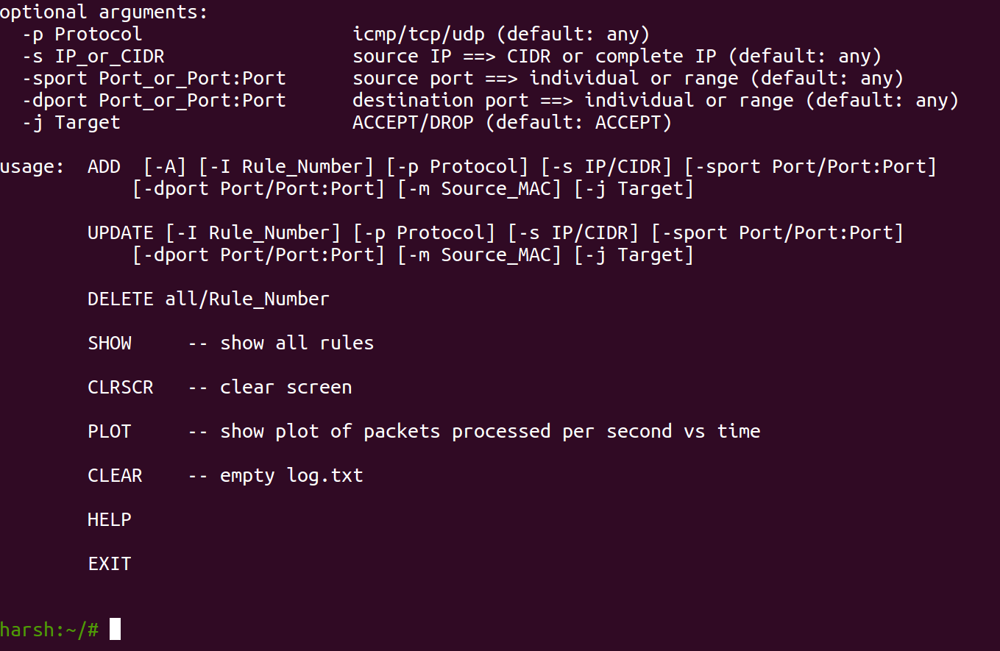

# Firewall

### Objectives of the Project
-----------------------------

+ Implement a fully functional firewall in python for a linux system.
+ Test and analyze it's performance
A detailed explanation of the problem statement can be found [here](https://github.com/sipian/Computer-Network-Security/blob/master/Project-Firewall/Firewall.pdf)

### Contributors
----------------

+ [Harsh Agarwal](https://github.com/sipian)
+ [Ayush Pateria](http://github.com/ayushpateria)

### How to run
+ Install NFQueue from [here](https://pypi.org/project/NetfilterQueue/)
+ Run `iptables -I INPUT -j NFQUEUE --queue-num 1` to redirect all incoming packets to an nfqueue with queue number 1.
`main.py` dequeus packets from this queue and processes them.
+ Run `python3 cli.py` and `python3 main.py` in two separate terminals.
+ `cli.py` will start an interactive terminal where  you can add your firewall rules. Use the notation given in the help messages to add firewall rules. We have followed `iptables` input format for adding firewalls rules. 
A screenshot of the output of cli.py has been attached for your reference

+ The incoming packets and detailed analysis of the firewall can be seen in the output of main.py and cli.py

**Please note that a detailed report describing all abilities and a thorough anaylysis of it's performance can be found in [`Report.pdf`](https://github.com/sipian/Computer-Network-Security/blob/master/Project-Firewall/Report.pdf)**
